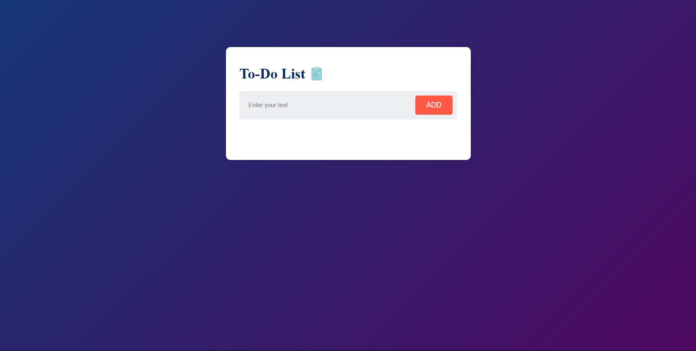

---

# To-Do List

## Description

A simple and intuitive To-Do List application that allows users to add, mark as complete, and remove tasks. The app uses localStorage to save the tasks so that they persist even after refreshing the page.

## Features

- **Add Tasks:** Users can enter text and click the "ADD" button or press Enter to add a new task.
- **Mark Tasks as Complete:** Clicking on a task toggles its completion status.
- **Remove Tasks:** Each task has a close button to remove it from the list.
- **Persist Tasks:** Tasks are saved in localStorage, so they remain on the page even after refreshing.

## Technologies Used

- **HTML:** Structure of the application.
- **CSS:** Styling the app to make it visually appealing.
- **JavaScript:** Adding interactivity and managing tasks.

## Project Structure

- `index.html` – The main HTML file for the To-Do List application.
- `style.css` – The CSS file for styling the To-Do List application.
- `script.js` – The JavaScript file containing the logic for the To-Do List functionality.
- `images/` – Directory for image assets used in the project (`image.png`, `unchecked.png`, `checked.png`,`image2.png`).

## Installation

To run this project locally:

1. **Clone the repository:**

   ```bash
   git clone [repository-url]
   ```

2. **Navigate to the project directory:**

   ```bash
   cd [project-directory]
   ```

3. **Open `index.html` in a web browser.**

## Usage

1. **Enter a task** in the input box.
2. **Click the "ADD" button** or press Enter to add the task to the list.
3. **Click on a task** to mark it as complete or incomplete.
4. **Click the close button** (×) to remove a task from the list.

## Live Demo

You can view the live demo of the To-Do List application [TO-TO-LIST]( https://himanshutamoli24.github.io/to-do-list/).

### Live Demo Screenshot

Here's a screenshot of the To-Do List application:



## Code Overview

### HTML

- **`<input>`**: Text box for entering new tasks.
- **`<button>`**: Button to add the task to the list.
- **`<ul>`**: Container for the list of tasks.

### CSS

- **General Styles:** Basic styles for the container, todo app, and form elements.
- **Task Styles:** Styles for the tasks, including the checked state and the close button.

### JavaScript

- **Event Listeners:** 
  - `click` event on the ADD button and Enter key press to add tasks.
  - `click` event on tasks and close buttons to handle task completion and removal.
- **Local Storage:** Save and retrieve tasks using `localStorage`.


## Future Improvements

- Add task due dates.
- Integrate with a backend service for task storage.
- Implement task prioritization.

## Contributing

Feel free to fork the repository and submit pull requests for any improvements or bug fixes.

## License

This project is licensed under the [MIT License](LICENSE).

## Contact

For any questions or suggestions, you can reach out to [himanshutamoli2005@gmail.com](mailto:himanshutamoli2005@gmail.com).
